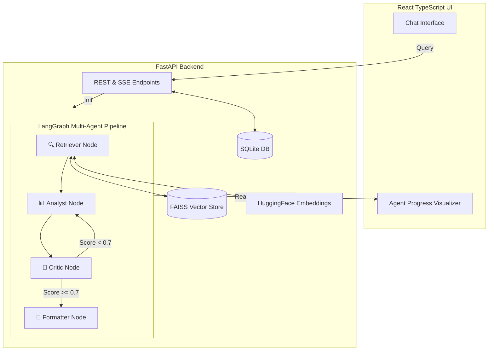

<div align="center">
  <h1>🏛️ Avanam</h1>
  <p><strong>A Production-Ready Multi-Agent RAG Document Intelligence Platform</strong></p>

  <p>
    
    
    
    
    
  </p>
</div>

## 📖 Overview

**Avanam** (meaning "arena" or "stage") is a high-performance, full-stack Document Intelligence Platform. It leverages a state-of-the-art **Multi-Agent RAG (Retrieval-Augmented Generation) pipeline** to not just retrieve information, but to actively synthesize, fact-check, and format insights from your documents.

Built as a demonstration of modern AI engineering, Avanam features a **live-streaming agent visualization UI**, allowing users to watch AI agents collaborate, debate, and revise their work in real-time. 

**The best part?** The entire stack is architected to run at **$0 cost** in production, utilizing the Google Gemini API free tier, local HuggingFace embeddings, and SQLite.

## ✨ Key Features

* 🤖 **4-Agent LangGraph Pipeline:** A cyclic workflow featuring a Retriever, Analyst, Critic, and Formatter.
* 🔄 **Autonomous Revision Loops:** The Critic agent scores the Analyst's work. If confidence falls below 70%, the work is kicked back for revision automatically.
* ⚡ **Live Agent Telemetry:** An advanced React frontend consumes Server-Sent Events (SSE) to visualize exact agent states, progress bars, and intermediate outputs in real-time.
* 🗄️ **Zero-Cost Local RAG:** Uses `sentence-transformers/all-MiniLM-L6-v2` running locally and FAISS (Facebook AI Similarity Search) for blazingly fast vector retrieval without API costs.
* 📄 **Multi-Format Ingestion:** Drag-and-drop support for PDF, DOCX, TXT, and Markdown files with automatic chunking and indexing.
* 📊 **Analytics Dashboard:** Tracks query latency, average agent confidence scores, and vector database health.
* 🐳 **Production-Ready Infra:** Fully containerized with Docker Compose, multi-stage Vite/Nginx frontend builds, structured JSON logging (`structlog`), and automated GitHub Actions CI/CD.

---

## 🧠 System Architecture



---

## 🛠️ Technology Stack

### Backend
* **Framework:** FastAPI, Uvicorn
* **AI Orchestration:** LangGraph, LangChain
* **LLM:** Google Gemini (`gemini-2.0-flash` free tier)
* **Embeddings:** HuggingFace `all-MiniLM-L6-v2`
* **Vector Store:** FAISS (CPU)
* **Database & ORM:** SQLite, SQLAlchemy (`aiosqlite`)
* **Streaming:** Server-Sent Events (`sse-starlette`)

### Frontend
* **Framework:** React 18, TypeScript, Vite
* **State Management:** Zustand
* **Animations:** Framer Motion
* **Styling:** Custom CSS (Premium Glassmorphism Design System)
* **Markdown:** `react-markdown`, `remark-gfm`

### DevOps
* **Containerization:** Docker, Docker Compose
* **Web Server:** Nginx (Alpine)
* **CI/CD:** GitHub Actions (Automated Linting & Pytest)

---

## 🚀 Getting Started

### Prerequisites
* [Docker](https://docs.docker.com/get-docker/) and Docker Compose
* A free [Google AI Studio API Key](https://aistudio.google.com/)

### Installation

1. **Clone the repository**
   ```bash
   git clone https://github.com/yourusername/avanam.git
   cd avanam
   ```

2. **Configure Environment Variables**
   Rename the example environment file in the backend directory:
   ```bash
   cp backend/.env.example backend/.env
   ```
   Open `backend/.env` and add your Gemini API key:
   ```env
   GOOGLE_API_KEY=your_actual_api_key_here
   ```

3. **Start the Application**
   Spin up the entire stack using Docker Compose:
   ```bash
   docker-compose up --build
   ```
   *(Note: The first run may take a few minutes as it downloads the HuggingFace embedding model locally).*

4. **Access the Platform**
   * **Frontend UI:** [http://localhost:3000](http://localhost:3000)
   * **Backend API Docs:** [http://localhost:8000/docs](http://localhost:8000/docs)

---

## 🕵️ How the Multi-Agent Pipeline Works

Avanam moves beyond simple "Retrieval Augmented Generation" by employing a team of specialized agents:

1. **🔍 Retriever Agent:** Translates the user's query into a vector representation and searches the FAISS index for the top-5 most relevant document chunks.
2. **📊 Analyst Agent:** Synthesizes the retrieved chunks into a comprehensive answer, carefully mapping every statement back to a specific source citation. It also extracts a structured list of its core "claims".
3. **🧪 Critic Agent:** The quality-assurance engine. It takes the Analyst's claims and cross-references them against the original source text to check for hallucinations. It outputs a Confidence Score (0.0 to 1.0). If the score is below 0.7, it triggers a **Revision Loop**, sending actionable feedback back to the Analyst.
4. **📝 Formatter Agent:** Takes the final, approved analysis and formats it into a highly readable Markdown response, appending interactive source citations.

---

## 📁 Project Structure

```text
├── backend/
│   ├── app/
│   │   ├── agents/          # LangGraph Nodes (retriever, analyst, critic, formatter)
│   │   ├── api/             # FastAPI Routes (query, documents, health)
│   │   ├── core/            # Database config, Event Bus (SSE), Structured Logger
│   │   ├── models/          # SQLAlchemy ORM and Pydantic schemas
│   │   └── services/        # FAISS Vector Store, Document Chunking, HuggingFace
│   ├── data/                # Persistent volumes for SQLite and FAISS
│   └── tests/               # Pytest suite
├── frontend/
│   ├── src/
│   │   ├── components/      # React components (AgentProgress, Chat, Documents, Dashboard)
│   │   ├── hooks/           # useSSE (Streaming event parser)
│   │   ├── services/        # API Client
│   │   ├── store/           # Zustand global state
│   │   └── index.css        # Premium Design System
│   └── nginx.conf           # Nginx reverse proxy configuration
├── docker-compose.yml       # Multi-container orchestration
└── .github/workflows/       # CI/CD Pipelines
```

---

## 📜 License

This project is licensed under the MIT License - see the [LICENSE](LICENSE) file for details.

<div align="center">
  <i>Built with ❤️ for modern AI engineering.</i>
</div>
